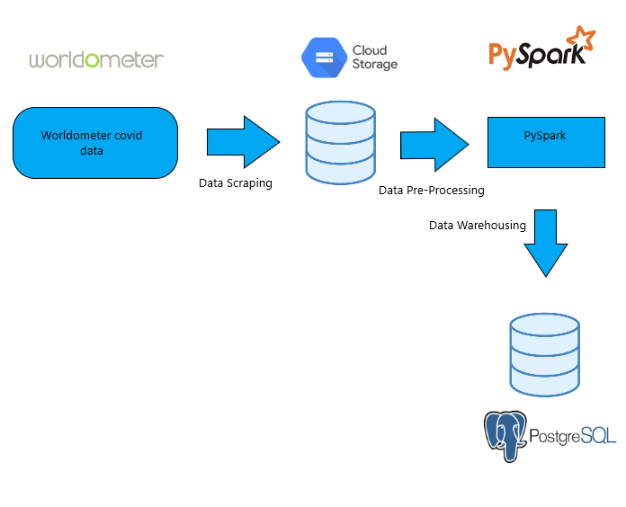

# Worldometer Covid Data Pipeline

### Goal Of Project

  Create architecture to perform ETL on Worldometer Covid data.
  
### Data Architecture Plan

  For this I will scrape the Covid-19 Worldometer table that has worldwide data, afterwhich I will store said data in Google Cloud Storage
  and then add some statistical columns using PySpark and finally, I will store the processed data into PostgreSQL.
  
## Data Project Architecture

